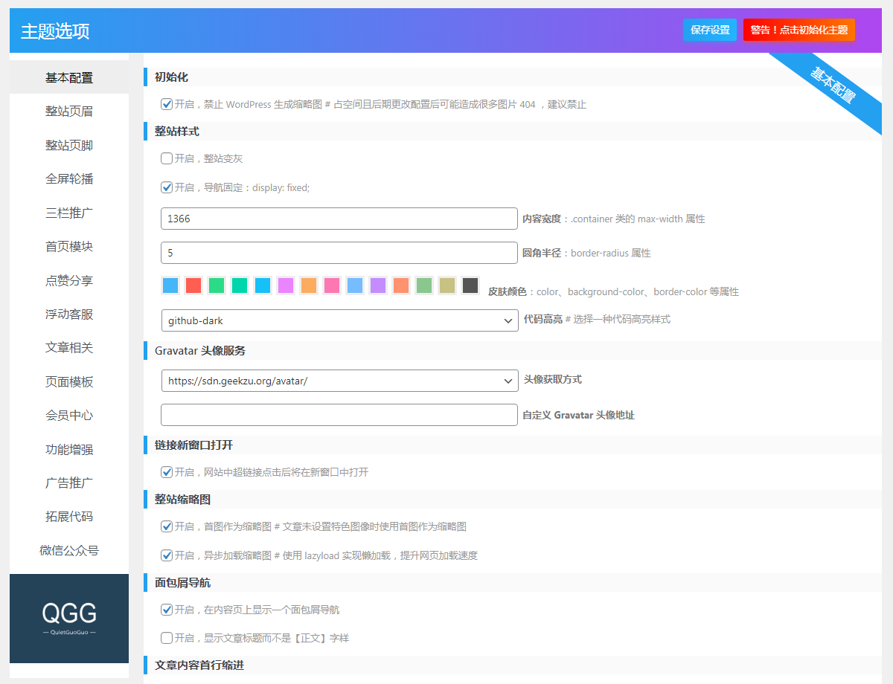
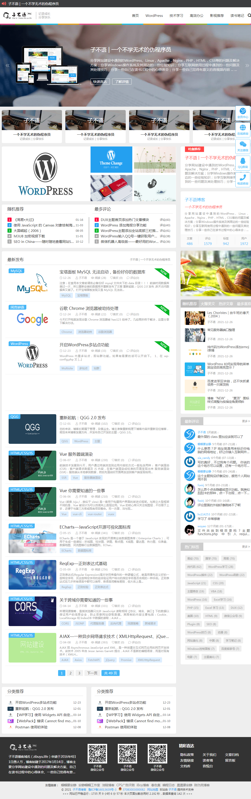
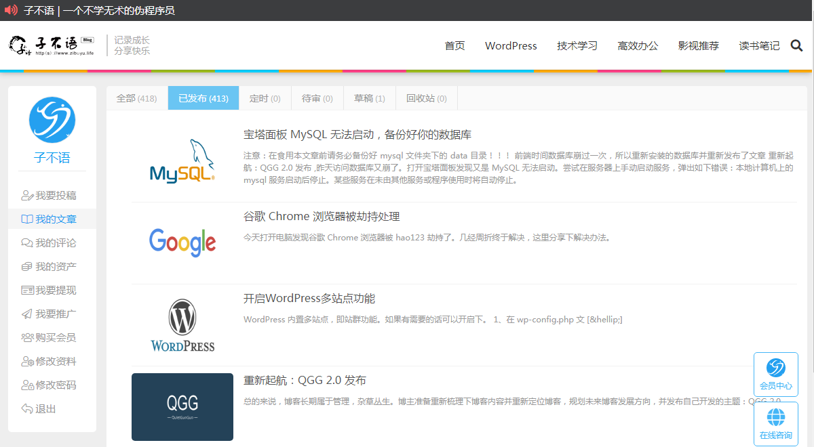
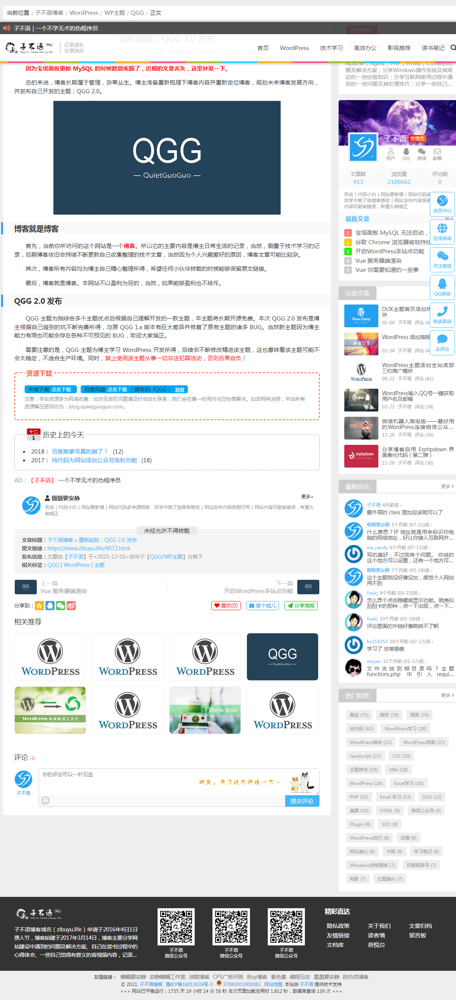
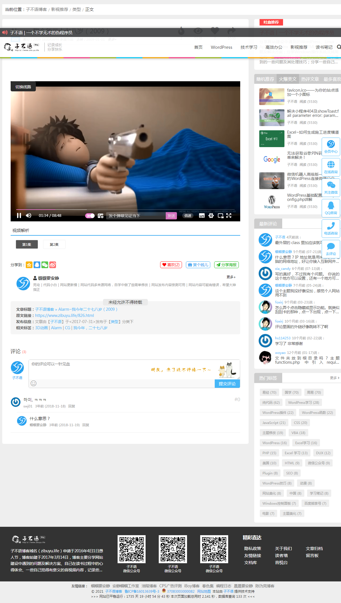
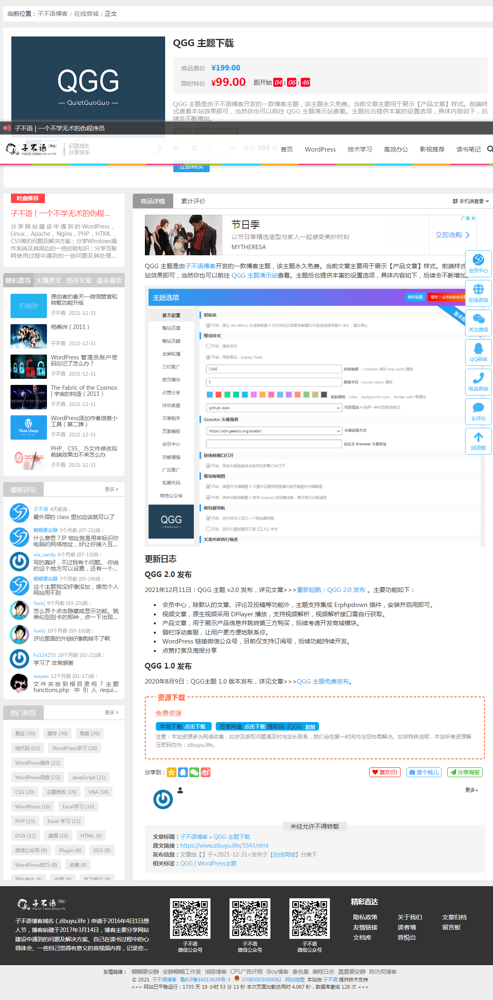
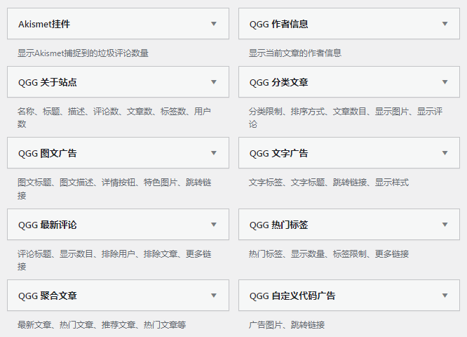

# wordpress-theme-qgg

### 【免责声明】
本主题为[子不语博客](http://zibuyu.life)自用主题，主要用于学习 WordPress 建站及 PHP 开发等。故对本主题做如下声明：

- 主题采用 [GNU GPLv2](http://www.gnu.org/licenses/gpl-2.0.html) 开源软件许可协议，请仔细阅读该协议
- 主题仅为学习交流使用，禁止用于非法用途！否则，使用者承担全部责任
- 能力有限，无法保证代码中不存在漏洞，请谨慎使用

### 主题目录
- action：网络请求相关内容
- assets：静态资源文件
- categories：分类页面模板文件
- enhance：主题增强的一些功能
- functions：核心功能函数
- modules：主题功能模块
- pages：静态页面模板
- posts：文章页面模板
- settings：后台设置面板，使用 [OptionsFramework](https://github.com/devinsays/options-framework-theme) 框架
- wechat-official：微信公众号开发相关
- widgets：主题小工具相关功能
  
### 所用技术
- [require.js](https://requirejs.org/)：JS 模块加载器，按需加载使用到的 JS 文件，提升网站性能。因与 layer.js 冲突，已修改定义方式为：jsdefine。
- [jquery.js](https://jquery.com/)：功能丰富的 JS 库，比原生 JS 操作 DOM 更方便。
- [jquery.lazyload.js](https://github.com/tuupola/lazyload)：jQuery 图片延迟加载插件，提升网页速度。
- [jquery.cookie.js](https://github.com/carhartl/jquery-cookie#readme)：jQuery 读写 Cookie 插件，方便操作 Cookie 存取数据。
- [jquery.qrcode.js](https://github.com/alphatr/jquery-qrcode)：jQuery 前端的二维码生成库，用于生成页面二维码。
- [swiper.js](https://www.swiper.com.cn/)：JS 轮播图幻灯片插件，移动端兼容。
- [swiper.animate.js](https://www.swiper.com.cn/usage/animate/index.html)：幻灯片 CSS3 动画效果实现。
- [ias.js](https://infiniteajaxscroll.com/)：AJAX 分页无限加载，3.x 版本改为原生 JS 开发。
- [jsrender.js](https://www.jsviews.com/#jsrender)：JS 模板渲染引擎，主要用于会员中心页面渲染。
- [router.js](#)：JS 路由插件，主要用于会员中心路由跳转（年久失修，考虑更换）。

### 主题功能

目前已集成基础博客、会员中心、客服系统、视频列表、商品发布、微信公众号对接等功能，且方便高级用户后期自主拓展分类页面模板、静态页面模板、文章页面模板、侧栏小工具等功能。

#### 后台设置页面

#### 前端页面展示
##### 网站首页

> ***如何增加公共模块？***
> _module_loader() 函数加载模板文件即可。

**会员中心**

**文章页模板**

> ***如何增加文章页模板？***
> _module_loader() 函数加载模板文件即可。

默认文章

视频文章

产品文章

**静态页模板**

> ***如何增加静态页模板？***
> _module_loader() 函数加载模板文件即可。
> 
页面太多了就不一一展示了，目前主要包括：
- 友情链接：https://www.zibuyu.life/friendly-links
- 文章归档：https://www.zibuyu.life/timeline
- 读者墙：https://www.zibuyu.life/readers
- 站点地图：https://www.zibuyu.life/sitemap-html
- 用户中心：https://www.zibuyu.life/user-center#posts/all
- 找回密码：https://www.zibuyu.life/reset-password

**分类页模板**

> ***如何增加分类页模板？***
> _module_loader() 函数加载模板文件即可。
> 
页面太多了就不一一展示了，目前主要包括：
默认分类：https://www.zibuyu.life/category/wordpress
视频分类：https://www.zibuyu.life/category/video
产品分类：https://www.zibuyu.life/category/shop

**侧栏小工具**

> ***如何增加侧栏小工具？***
> _module_loader() 函数加载模板文件即可。

